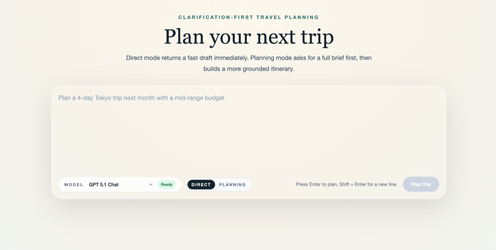
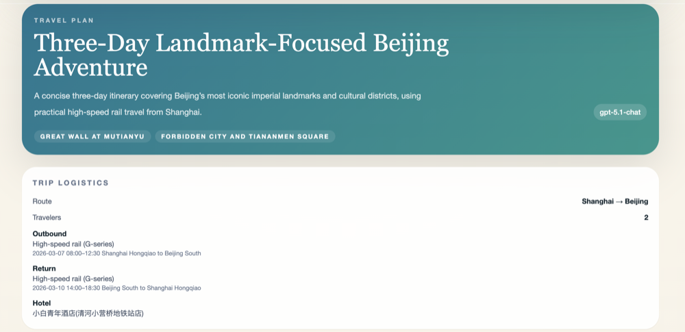
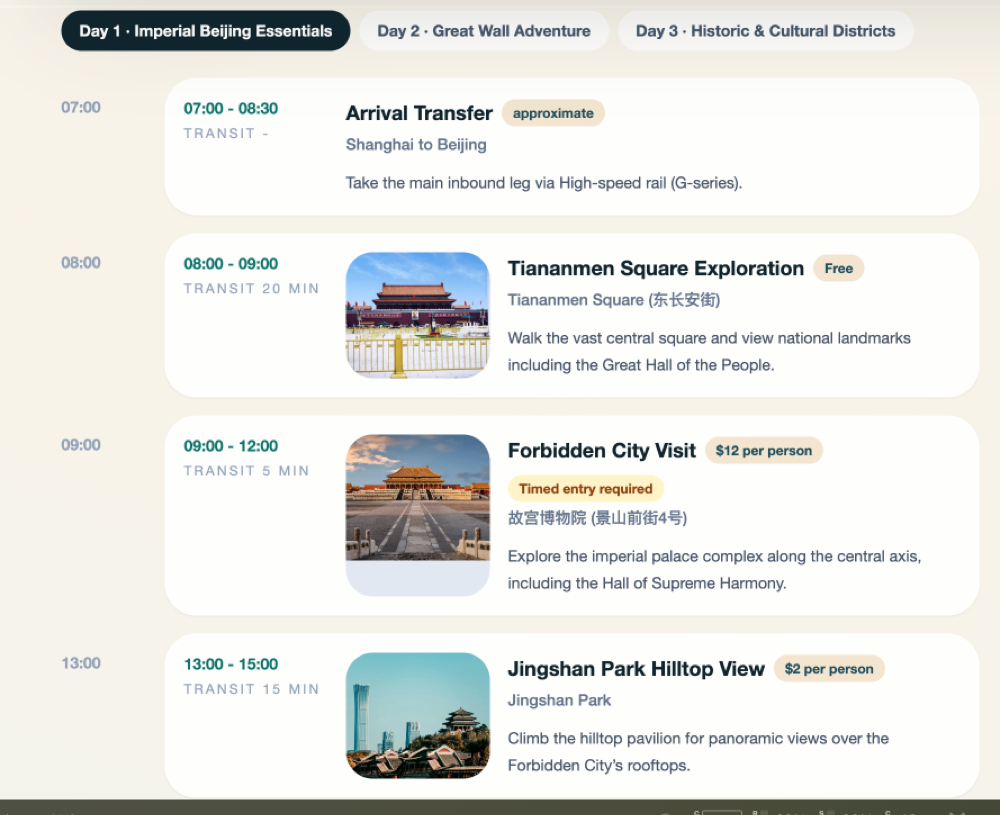
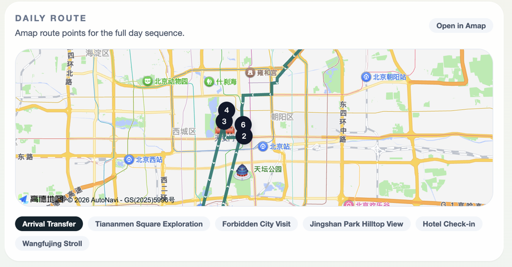
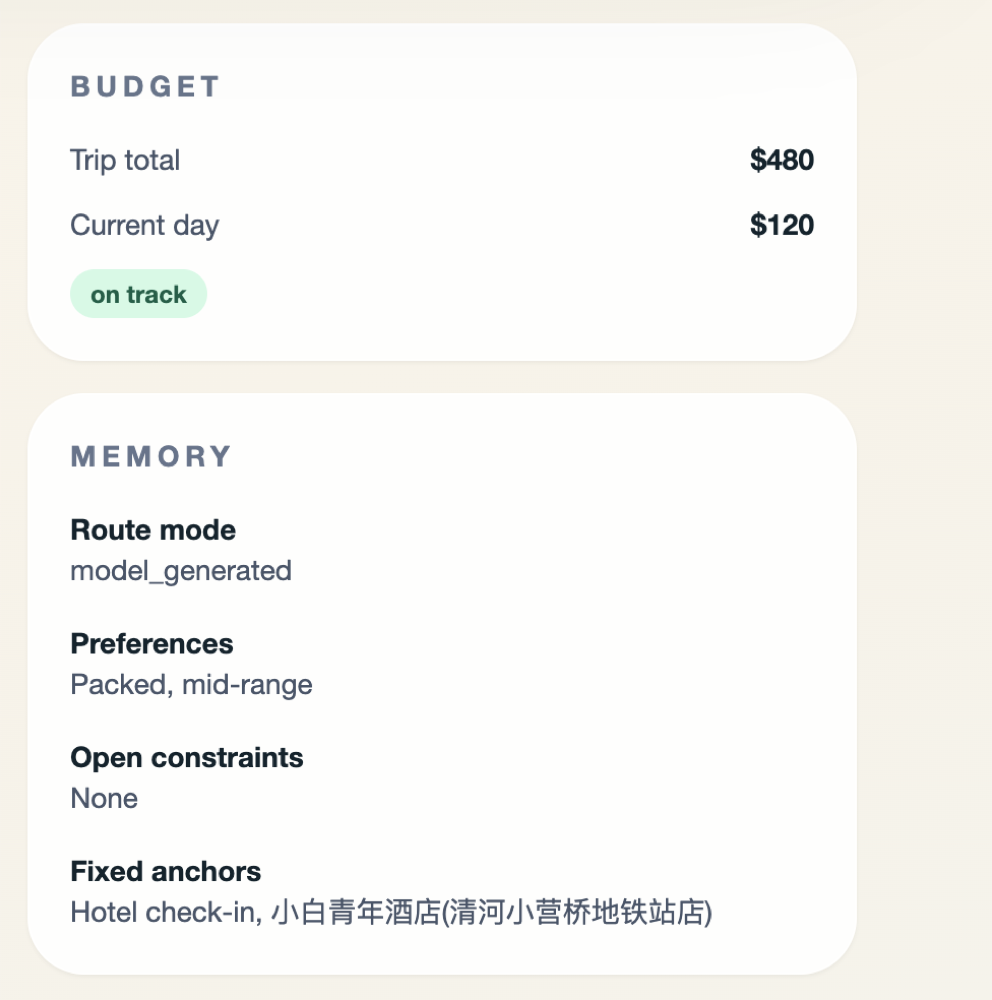
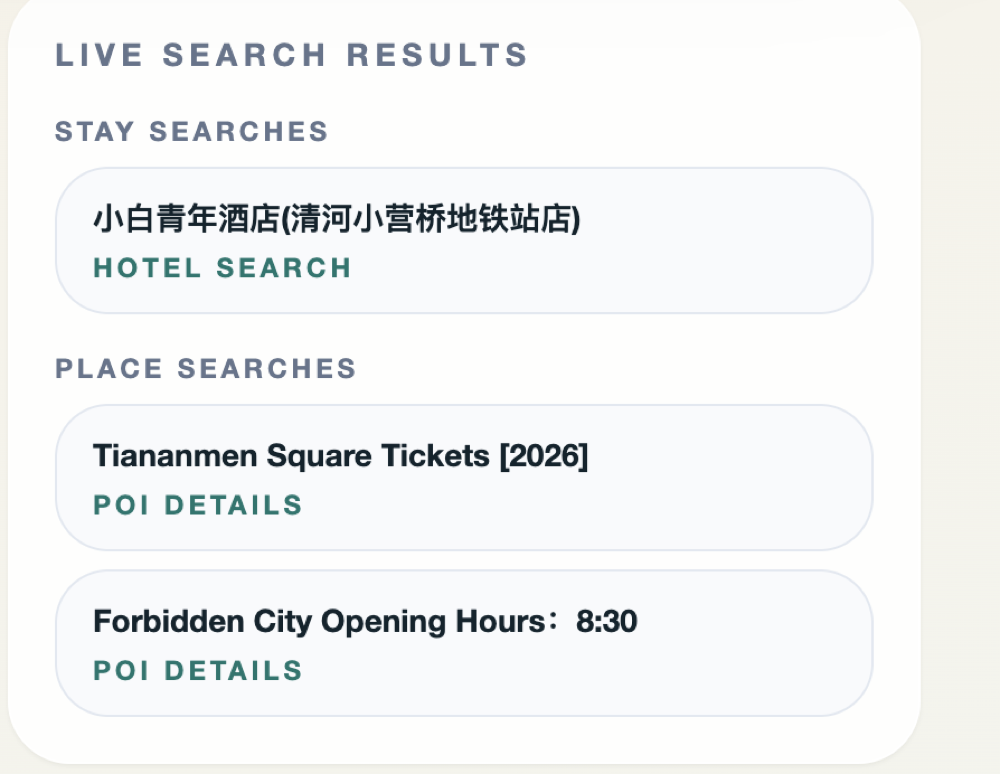
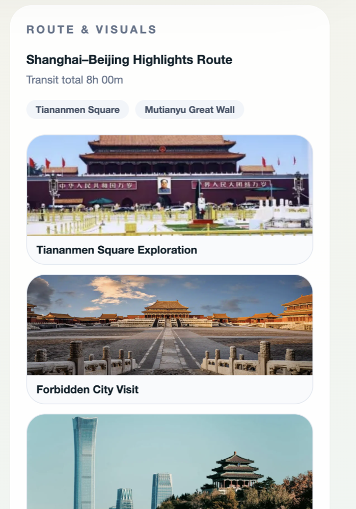
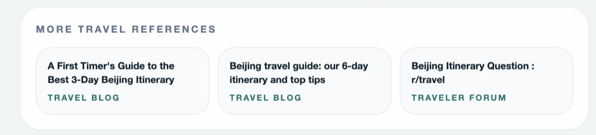
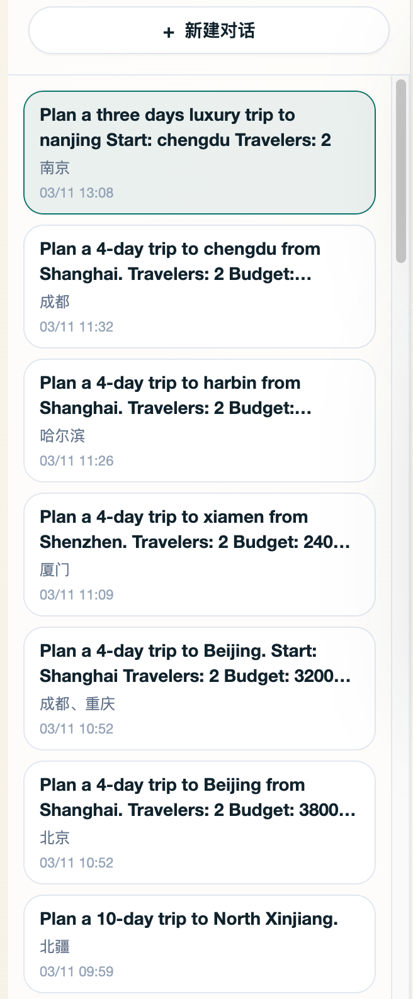

# Travel Agent

Clarification-first travel planning app with a React frontend and FastAPI backend.

## Highlights

- Two interaction modes:
  - `direct`: generate itinerary directly
  - `planning`: ask clarification questions first, then generate itinerary
- Model selection in UI (`gpt-5.1-chat`, `gemini-3-flash-preview`, `deepseek-v3.2`)
- Structured itinerary output:
  - multi-day timeline
  - travel logistics card
  - budget summary
  - reference links and visual references
- Day route map:
  - AMap JS map when browser key is configured
  - SVG fallback map when browser key is missing
- Trip history persisted in SQLite (`backend/travel_agent.db`)
- Conversation history query:
  - each follow-up message is saved as part of trip history
  - you can query previous conversations and reopen them in UI
- Planner state persisted in browser local storage
- Provider and tool mock fallback support via feature flags

## Demo

### Front-end input interface


### Backend interface overview


### Specific daily plans


### Daily route map


### Budget and memory


### Supplementary search results


### Other visuals


### Travel blog links


### history conversation


### Static HTML Export
Pre-generated demo file: [Travel Agent Demo](./images/Travel%20Agent.html)

## Project Structure

- `apps/web`: React + Vite frontend
- `backend`: FastAPI backend, orchestration, tools, SQLite persistence

Key files:

- `apps/web/src/pages/TripPlannerPage.tsx`
- `apps/web/src/components/ItineraryWorkspace.tsx`
- `backend/app/main.py`
- `backend/app/api/routes/trips.py`
- `backend/app/agent/orchestrator.py`

## Backend API

- `GET /api/health`: provider and tool health summary
- `GET /api/models`: supported model list + default model
- `POST /api/trips`: create a trip
- `GET /api/trips`: list historical conversations/trips from SQLite
- `GET /api/trips/{trip_id}`: retrieve one historical conversation/trip
- `POST /api/trips/{trip_id}/messages`: continue a trip with follow-up input
- `POST /api/trips/{trip_id}/reorder`: reorder events in a day
- `POST /api/trips/{trip_id}/regenerate`: regenerate trip content

## Planning Flow (Current Code)

1. Parse user intent from free-form query
2. If needed, generate clarification questions (`planning` mode)
3. Build draft itinerary with selected model
4. Enrich itinerary using tool context and heuristics
5. Build route points and map data
6. Persist trip to SQLite

## Model & Tool Providers

### Models

Configured via OpenAI-compatible style endpoints:

- `gpt-5.1-chat`
- `gemini-3-flash-preview`
- `deepseek-v3.2`

Backend resolver supports:

- request-level override (`model_config.api_key`, `model_config.base_url`)
- env-based credentials
- mock fallback when enabled

### Tools in current runtime path

- `amap_mcp` / AMap services: POI lookup, geocode, route and travel-time estimation
- `serper_search`: web search + image search + flight/hotel snippets
- `tavily_search`: web search support
- `visual_search`: local visual fallback mode

## Environment Configuration

### Backend env

Copy from template:

- `backend/.env.example` -> `backend/.env`

Important variables:

- App:
  - `APP_ENV`
  - `APP_HOST`
  - `APP_PORT`
  - `ENABLE_MOCK_MODEL_FALLBACK`
  - `ENABLE_MOCK_TOOL_FALLBACK`
- Models:
  - `GPT_5_1_CHAT_API_KEY`
  - `GPT_5_1_CHAT_BASE_URL`
  - `GEMINI_3_FLASH_PREVIEW_API_KEY`
  - `GEMINI_3_FLASH_PREVIEW_BASE_URL`
  - `DEEPSEEK_V3_2_API_KEY`
  - `DEEPSEEK_V3_2_BASE_URL`
- Tools:
  - `AMAP_API_KEY`
  - `AMAP_MAPS_API_KEY`
  - `SERPER_API_KEY`
  - `TAVILY_API_KEY`
- Optional / legacy:
  - `LANGCHAIN_API_KEY`

### Frontend env

Copy from template:

- `apps/web/.env.example` -> `apps/web/.env`

Variables:

- `VITE_API_BASE_URL` (default backend URL is `http://localhost:8000`)
- `VITE_AMAP_KEY` (browser JS key)
- `VITE_AMAP_SECURITY_JS_CODE` (AMap security code)

## Install

### 1) Install frontend dependencies

```bash
pnpm install
```

### 2) Install backend dependencies

```bash
cd backend
uv sync
```

## Run Locally

### Start backend

From repo root:

```bash
pnpm dev:backend
```

Or directly:

```bash
cd backend
uv run uvicorn app.main:app --reload
```

Backend default URL: `http://127.0.0.1:8000`

### Start frontend

From repo root:

```bash
pnpm dev:web
```

Frontend default URL: `http://localhost:5173`

## Quick Usage

Try prompts like:

- `Plan a 4-day trip to Beijing from Shanghai`
- `Plan a 10-day trip to North Xinjiang`
- `Plan a 6-day trip to Chengdu and Chongqing from Shenzhen`

UI shortcuts:

- `Enter`: submit
- `Shift + Enter`: newline
- `Tab`: cycle demo planning prompts

## Notes

- Backend logs are at `INFO` level and include planner/tool stages.
- Tool and image requests are cached in `backend/tool_cache.sqlite3`.
- If map JS key is missing or invalid, frontend automatically falls back to SVG route rendering.
